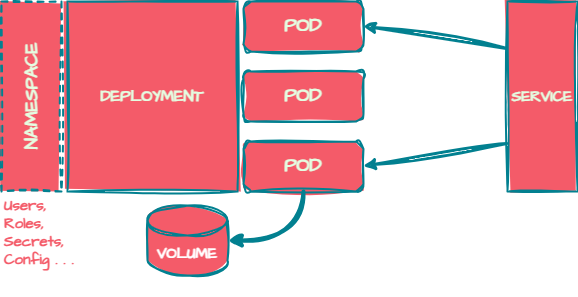

# UNIDAD 5: INTRODUCCIÓN A KUBERNETES (K8S)

## **¿QUE ES KUBERNETES?**

Es una **plataforma de código abierto** que sirve para **automatizar** la implementación, escalado y **operación** de aplicaciones **con contenedores**. Desarrollado por Google y luego liberado como código abierto en 2014, actualmente es uno de los proyectos más populares de la Cloud Native Computing Foundation (CNCF). Ya que se ha convertido en la plataforma de orquestación de contenedores más utilizada y ampliamente adoptada por empresas de todo el mundo.

Kubernetes crea una **capa de abstracción entre la infraestructura y las aplicaciones**. Por ejemplo, teníendo **múltiples servidores**, te permite agruparlos en lo que llamariamos **clúster** y consumirlo **como una pieza individual**, permitiendo desplegar aplicaciones sobre todos los nodos del clúster de una forma transparente para el usuario.

Por ejemplo, en un entorno tradicional un administrador de sistemas tendría que provisionar una máquina virtual (con sus configuraciones de red, paquetería, hardware, etc) por cada aplicación.

{width="400"}

Mientras que en un entorno de Kubernetes, el administrador solo tiene que añadir y mantener los nodos del cluster, de modo que cuando se solicita una nueva aplicación, se le asigna una reserva lógica de recursos del cluster. Es decir, no le asignamos una "máquina" sino un numéro de recursos cuatificados en CPU y RAM, que no tienen por que estar en un nodo en concreto.

{width="600"}

En resumen, Kubernetes nos aporta:

* **Automatización** de tareas y simplicación de la operativa.
* **Escalabilidad** en función de la demanda (:arrow_up:Contenedores ó :arrow_up:Nodos).
* **Resiliencia** ante errores o caídas.
* **Estandarización** entre diferentes entornos (migraciones).
* **Ecosistemas** de servicios y funcionalidades.

!!! tip "Oportunidades laborales"
    Kubernetes es una tecnología muy demandada en el mercado laboral, por lo que tener conocimientos en Kubernetes puede abrirte muchas puertas en tu carrera profesional ya sea como especialista DevOps, Administrador de Sistemas o especialista en seguridad.

## **ARQUITECTURA DE KUBERNETES**

Todo clúster gestionado con Kubernetes consta de dos piezas fundamentales:

El *"control plane"* o **nodo maestro**: responsable de gestionar al resto de nodos del clúster. No ejecuta `pods` ni ningún tipo de carga de trabajo, solo se limita a interactuar con el resto de nodos y gestionar los recursos del clúster.

Los *"workers"* o **nodos de trabajo** alojan los `pods` (contenedores) y las cargas de trabajo, es decir, son los encargados de ejecutar las aplicaciones y servicios que se despliegan en el clúster.

{width="600"}

### **COMPONENTES BÁSICOS DE CUALQUIER NODO**

**CONTAINER RUNTIME**: es el software que se encarga de ejecutar los contenedores. **Docker** es el más popular, pero en Kubernetes lo más habitual es usar **containerd** o **CRI-O**, versiones más ligeras y especializadas es este tipo de entornos.

**KUBELET**: es el encargado de gestionar los contenedores en un nodo y de garantizar que estos se mantengan en el estado deseado. Se comunica con el API Server para recibir instrucciones y transmitirlas al runtime de contenedores.

**KUBE-PROXY**: gestiona el tráfico de red en el nodo. Se encarga de enrutar las peticiones a los servicios y de balancear la carga entre los pods. También se encarga de la exposición de los servicios al exterior. Traduce las necesidades de red de los servicios a reglas de iptables de forma automática.

### **COMPONENTES ESPECÍFICOS DEL NODO MAESTRO**

**KUBE-APISERVER**: es el punto de entrada al clúster. Es el componente que recibe las peticiones de los usuarios y de los nodos de trabajo. Es el único que se comunica directamente con la base de datos de Kubernetes, etcd. Almacena el estado del clúster, gestiona las peticiones y las transforma en acciones.

**KUBE-SCHEDULER**: es el encargado de decidir en qué nodo se ejecutará un pod. Se basa en las necesidades de los pods y en las capacidades de los nodos para tomar la decisión.

**ETCD**: es la base de datos de Kubernetes. Almacena el estado del clúster y es el único componente que almacena información de forma persistente. Es altamente consistente y tolerante a fallos.

**KUBE-CONTROLLER-MANAGER**: es el componente que se encarga de gestionar los controladores de Kubernetes. Los controladores son procesos que se ejecutan de forma continua y que se encargan de mantener el estado deseado del clúster. Por ejemplo, el controlador de replicación se encarga de mantener el número de réplicas de un pod en el estado deseado.

**CLOUD-CONTROLLER-MANAGER**: es como el kube-controller-manager pero para entornos en la nube. Se encarga de interactuar con los servicios del proveedor, como los volúmenes de almacenamiento, balanceadores de carga, etc.

En resumen, el **api** de kubernetes gestiona todas las peticiones de los usuarios o de los nodos y el **scheduler** decide donde se ejecutan los pods. Mientras que el **controlador** mantiene el estado deseado del clúster y el **etcd** almacena el estado del clúster.

## **INSTALACIÓN DE KUBERNETES**

Podemos crear un laboratorio práctico de Kubernetes con 3 máquinas virtuales Ubuntu (1 Nodo Maestro y 2 Nodos Trabajadores), pero es un procedimiento que requiere bastantes pasos y un equipo anfitrión de altas prestaciones. Puede verse un ejemplo en el siguiente [enlace](https://www.nakivo.com/es/blog/install-kubernetes-ubuntu/).

En nuestro caso, vamos a configurar un entorno de prácticas más ligero y facil de configurar usando *"KIND"* (Kubernetes in Docker), que nos permite crear un clúster Kubernetes en el que cada nodo sea un contenedor.

{width="400"}

### **INSTALACIÓN KUBERNETES CON KIND**

Partimos de una máquina Ubuntu en la que tenemos previamente instalado Docker. Entonces, vamos a descargar el binario de Kind y a colocarlo en un directorios accesible desde `$PATH`:

    curl -Lo ./kind https://kind.sigs.k8s.io/dl/v0.10.0/kind-linux-amd64
    chmod +x ./kind
    sudo mv ./kind /usr/local/bin
    kind version

Por otro lado, instalamos la utilidad `kubectl` que es el cliente usado para interactuar con nuestro clúster Kubernetes:

    curl -Lo ./kubectl "https://dl.k8s.io/release/$(curl -L -s https://dl.k8s.io/release/stable.txt)/bin/linux/amd64/kubectl"
    chmod +x ./kubectl
    sudo mv ./kubectl /usr/local/bin
    kubectl version --client

Con estos simples pasos, ya podemos empezar a definir nuestro cluster Kubernetes con Kind.

## **CREACIÓN DE UN CLUSTER CON KIND**

### PERSONALIZAR LA RED VIRTUAL DEL CLUSTER

Cuando levantamos un cluster con KIND, este crea una red Bridge llamada *kind* con un direccionamiento por defecto. Para que ese direccionamiento no se solape o interfiera en los direccionamientos que ya tenemos en uso, vamos a crear nosotros esa red con los parámetros que queramos:

    docker network create --subnet 192.168.0.0/24 --gateway 192.168.0.1 kind

### CREAR FICHERO DE CONFIGURACIÓN DEL CLUSTER

Por otro lado, podemos personalizar las características que tendrá nuestro cluster mediante el fichero `config.yaml`, como el nombre del cluster, el número de nodos, el rol de cada nodo, mapeado de puertos, direccionamiento de los pods y servicios, almacenamiento persistente, etc. Un ejemplo sencillo de un cluster con 4 nodos, puede ser:

??? info "nano **config.yaml**"
        kind: Cluster
        apiVersion: kind.x-k8s.io/v1alpha4
        name: cpd
        nodes:
        - role: control-plane
        - role: worker
        - role: worker
        - role: worker

### LEVANTAR EL CLUSTER

Por último, solo tenemos que crear nuestro cluster con el siguiente comando:

    kind create cluster --config=config.yaml

!!! tip "Credenciales de Acceso al Cluster"
    Podemos comprobar que cuando se crea un cluster, se crea también el fichero de configuración con nuestras credenciales para el acceso en `~/.kube/config`.

Comprobaremos que se han creado tantos contenedores como nodos habiamos indicado en el fichero de configuración:

    docker ps

Y si todo ha ido bien, podemos usar la funcionalidad `kubectl` para confirmar que todos los nodos están en estado **"Ready"**:

    kubectl get nodes
    kubectl config view

## **TIPOS DE OBJETOS KUBERNETES**

Un objeto o recurso, es cualquier cosa que podemos definir en un cluster de kubernetes. Cada objeto es de un tipo concreto y tiene unas propiedades y atributos que lo definen. Para definir un objeto, se hace mediante **archivos manifiesto** que se aplican al cluster para que se crear o modificar recursos. Estos manifiestos pueden ser escritos en formato YAML o JSON, y los principales objetos que podemos definir son:

**POD**: es el recurso más básico que podemos crear en Kubernetes, generalmente compuesto por un contenedor (o varios). No es habitual crear pods manualmente, si no a partir de un objeto *"Deployment"*.

**DEPLOYMENT**: generalmente se utilizan para definir aplicaciones compuestas por varios *"Pods"* y las características específicas de cada uno.

**SERVICE**: permite exponer los pods o aplicaciones para que se accede desde fuera del cluster.

**VOLUME**: usado para persistir información de uno o varios pods.

**NAMESPACE**: permite agrupar una serie de recursos en diferentes espacios lógicos separados, dentro del mismo cluster.

<figure markdown='span'>
    {width="400"}
    <small><figcaption>Objetos Kubernetes</figcaption></small>
</figure>

### LOS MANIFIESTOS .YAML

En el archivo .yaml del objeto que queramos crear, obligatoriamente debemos indicar (como mínimo) los siguientes apartados:

**apiVersion**: versión de la API de Kubernetes que se va a usar.
**kind**: tipo de objeto que quieres crear.
**metadata**: datos que identifican unívocamente al objeto (name, uid, namespace...).
**spec**: características específicas del objeto (contendores, volumenes...).

### CREANDO MI PRIMER POD

Un ejemplo de manifiesto para definir un pod, podría ser el siguiente:

    apiVersion: v1
    kind: Pod
    metadata:
    name: podtest
    spec:
    containers:
    - name: cont1
      image: nginx:alpine

### CREANDO MI PRIMER DEPLOYMENT

## :video_game: **PRÁCTICA**: DESPLIEGUE NGINX EN KUBERNETES

### CREAR EL FICHERO *DEPLOYMENT*

??? abstract "nano **deployment.yaml**"
        apiVersion: apps/v1
        kind: Deployment
        metadata:
        name: nginx
        namespace: default
        labels:
            app: nginx
        spec:
        revisionHistoryLimit: 2
        strategy:
            type: RollingUpdate
        replicas: 2
        selector:
            matchLabels:
            app: nginx
        template:
            metadata:
            labels:
                app: nginx
            spec:
            containers:
            - image: nginx
                name: nginx
                ports:
                - name: http
                containerPort: 80

### CREAR EL FICHERO *SERVICE*

??? abstract "nano **service.yaml**"
        apiVersion: v1
        kind: Service
        metadata:
        name: nginx
        namespace: default
        spec:
        type: NodePort
        ports:
        - name: http
            port: 80
            targetPort: http
        selector:
            app: nginx

### CREAR EL DESPLIEGUE Y EL SERVICIO

    kubectl apply -f deployment.yaml 
    kubectl create -f service.yaml

Comprobamos que se han creado los pods relativos al despiegue y estan en ejecución; y que se ha creado el servicio y sobre que puerto del nodo lo ha mapeado:

    kubectl get all

Por último, comprobamos la dirección ip que tiene el nodo maestro (ya que será el que reciba las peticiones):

    docker inspect cpd-control-plane | grep Address

Y si todo fue bien, abrimos un navegador y deberíamos poder acceder al servicio indicando la IP del nodo y el puerto en el que se ha mapeado el servicio. Por ejemplo `http://192.168.0.4:31287`.
