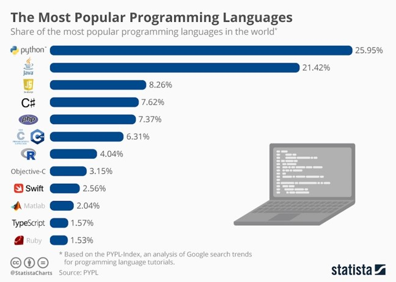
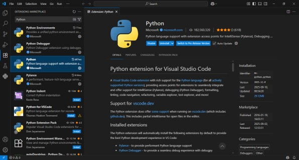
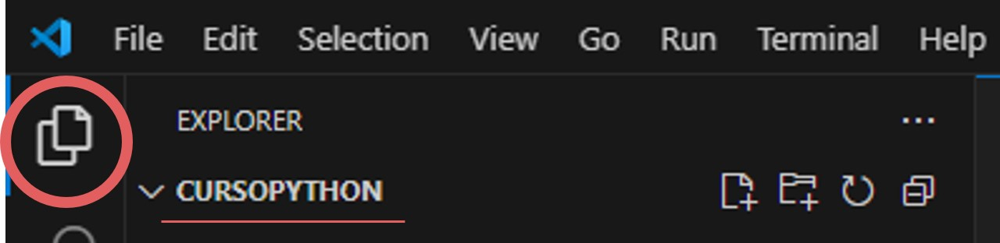

# UNIDAD 1: FUNDAMENTOS DE PYTHON :snake:

## ¿QUE ES PYTHON?

Python es un lenguaje de programación creado por Guido Van Rossum y lanzado en 1991. Aunque su logotipo son dos cabezas de pitón, su nombre no viene del nombre del animal, si no del grupo cómico ingles "Monty Python".

### Características principales

Se trata de un lenguaje de alto nivel, con tipado dinamico y fuerte. Además, es un lenguaje interpretado y orientado a objetos.

#### :tophat: Alto Nivel

Se dice que un lenguaje es de alto nivel cuando su sintaxis se asemeja más al lenguaje humano, que al lenguaje máquina. En este caso, podriamos decir que Python es de muy alto nivel, ya que tiene una gramática sencilla y facilmente legible. Se llega a decir (bromeando) que cualquiera que sepa inglés, puede entender código fuente en Python.

#### :muscle: Fuertemente Tipado

Quiere decir en este lenguaje hace una distinción estricta entre los diferentes tipos de datos, es decir, no va a permitir que una variable de un tipo específico (por ejemplo numérico) se utilice directamente como si fuera de otro tipo (como un texto) sin una conversión explícita.

#### :currency_exchange: Tipado Dinámico

Se refiere que el tipo de dato de una variable se asigna y verifica en tiempo de ejecución, no en la compilación. Esto quiere decir que una variable puede cambiar su tipo de dato durante la ejecución del programa y no necesitas declarar explícitamente el tipo de dato al crear la variable.

#### :calling: Interpretado

Quiere decir que es traducido y ejecutado línea por línea en tiempo real, sin necesidad de un paso de compilación previo. Un programa llamado intérprete lee y ejecuta directamente el código fuente. Esto aporta facilidad para desarrollar y depurar, y para su portabilidad entre diferentes sistemas operativos.

#### :blue_car: Orientado a objetos

Es un paradigma de programación donde, mediante código fuente, se trata de representar entidades u objetos del mundo real. Para ello se crean clases (objetos), que definen una serie de características (atributos) y comportamientos (métodos) propios de dicho objeto. Estas clases son usadas luego a modo de plantillas, permitiendo la reutilización de código, mejor organización y modularidad, encapsulación de datos y un facil mantenimiento y modificación de los programas.

## ¿PORQUE APRENDER PYTHON?

**Ampliamente utilizado en múltitud de campos laborales**:
{width="500"}

**Uno de los lenguajes de programación más popular en la actualidad**:
{width="500"}

## INSTALACIÓN DE PYTHON

- Descargar desde: [https://www.python.org/downloads](https://www.python.org/downloads)
- Asegúrate de marcar la opción **"Add Python to PATH"** en Windows.
- Podemos verificar la instalación así como la versión instalada con el siguiente comando:

```bash
python --version
```

## INSTALACIÓN Y CONFIGURACIÓN DEL ENTORNO DE DESARROLLO

- Existen multitud de IDE que podemos usar para programar en Python, en nuestro caso usaremos **VsCode**
- Descargar desde: [https://code.visualstudio.com/download](https://code.visualstudio.com/download)
- Como antes, marcamos la opción **"Add to PATH"**.
- Una vez instalado, vamos a la pestaña **Extensiones** y debemos buscar e instalar **Python** (de Microsoft). Con ella obtendremos una serie de extensiones que nos ofrecen diferentes funcionalidades a la hora de programar en Python.


## CREACIÓN DE UN ENTORNO VIRTUAL

### ¿Que es?

Es un directorio aislado que contiene una instalación de Python y sus propias librerías y paquetes. Su principal objetivo es aislar las dependencias entre diferentes proyectos para evitar conflictos entre diferentes versiones de paquetes y asegurar que cada proyecto tenga unicamente las bibliotecas que necesita.

### Trabajar con entornos virtuales en VsCode

#### :one: Pasos Previos

En primer lugar crearemos el directorio físico donde se alojaran los archivos de nuestro proyecto.

Luego abrimos ese directorio en el Explorador de VsCode:


#### :two: Creación

Desde la pestaña **Terminal** abrimos un nuevo terminal y ejecutamos el siguiente comando, que creará nuestro entorno virtual:

```bash
python -m venv envMiEntorno
```

#### :three:  Activación

Una vez hemos creado el entorno, debemos activarlo. Para ello escribiremos lo siguiente:

```bash
envMiEntorno\Scripts\activate
```

!!!danger "Posible Error de Activación"
    Es posible que recibamos un error al ejecutar el comando anterior, ya que Windows por defecto tiene deshabilitada la ejecución de scripts. En ese caso, abriremos PowerShell como Administrador y ejecutamos los siguientes comandos:

```powershell
Get-ExecutionPolicy -List
Set-ExecutionPolicy RemoteSigned -Scope CurrentUser
```

#### :four: Instalación de librerías externas

Mediante el comando **pip** accedemos al gestor de paquetes estándar de Python, que nos permite instalar y administrar software de terceros fácilmente, para que podamos usarlo en nuestro proyecto. Para ello hace uso del repositorio [Python Package Index (PyPI)](https://pypi.org/). Por ejemplo:

```bash
pip install mkdocs
pip install mkdocs-material
```


#### :five: Listar dependencias

Una **dependencia** es cualquier paquete software o librería externa que tu proyecto requiere para funcionar, pero que no está incluido en la instalación básica de Python.

Por lo tanto, cada vez que instalamos un nuevo paquete, estamos añadiendo dependencias a nuestro proyecto.

Con el siguiente comando podemos ver cada una de las dependencias instaladas en nuestro entorno virtual, con sus correspondientes versiones:

```bash
pip freeze
```

#### :six: Exportar dependencias

Por buenas prácticas de programación, los entornos virtuales nunca se suben a los repositorios de *"git"* o de cualquier otro manejador de versiones.

Por ello, siempre es muy recomendable crear un archivo llamado **requirements.txt**, en el cual almacenaremos el listado de todas las dependencias que necesita nuestro proyecto:

```bash
pip freeze > requirements.txt
```

Este archivo SI se sube al repositorio. De modo que, podremos generar nuevamente nuestro entorno en cualquier dispositivo o sistema operativo que deseemos, mediante el siguiente comando:

```bash
pip install -r requirements.txt
```

## ESTRUCTURA DE UN PROGRAMA EN PYTHON

Un programa Python se divide en un número de líneas lógicas que se ejecutan de forma seuencial.

El final de una línea lógica está representado por el caracter especial NEWLINE (salto de línea).

**Unión de líneas explícita**: dos o más líneas físicas pueden unirse en una única línea lógica utilizando el caracter de barra invertida **(\)**. Una línea que termina en barra invertida no puede llevar un comentario.

```python
if 1900 < year < 2100 and 1 <= month <= 12 \
   and 1 <= day <= 31 and 0 <= hour < 24 \
   and 0 <= minute < 60 and 0 <= second < 60:   # Parece una fecha válida
        return 1 
```

**Unión de líneas implicita**: las expresiones entre paréntesis, entre corchetes o entre rizos pueden dividirse en más de una línea física sin usar barras invertidas. Las líneas continuas implícitas pueden llevar comentarios.

```python
month_names = ['Januari', 'Februari', 'Maart',      # Son los
               'April',   'Mei',      'Juni',       # nombres holandeses
               'Juli',    'Augustus', 'September',  # para los meses
               'Oktober', 'November', 'December']   # del año 
```

**Sangría o Indentación**: a diferencia de otros lenguajes, en Python los espacios en blanco o tabulaciones al principio de cada línea de código, son un requisito de sintaxis que afecta directamente al funcionamiento del programa. Ya que se utilizan para agrupar instrucciones y definir bloques de código, indicando qué líneas pertenecen, por ejemplo, a una función, un bucle o una condición.

En resumen, un programa de Python se construye a partir de uno o varios bloques de código. Llamando bloque a cada parte del código del programa que se ejecuta como una unidad. Como pueden ser por ejemplo, un módulo, el cuerpo de una función o la definición de una clase.

## SINTÁXIS BÁSICA Y CONVENCIONES

### Convenciones del Lenguaje

Se recomienda usar 4 espacios para cada nivel de indentación.

Uso de **snake_case** para variables, funciones y métodos.

```python
nombre_usuario = "Juan" 
```

Uso de **PascalCase** para clases.

```python
class MiClase 
```

Uso de **UPPERCASE** para variables cuyo valor será el mismo durante toda la ejecución.

```python
PI = 3.14159
```

### Uso de comentarios y documentación del código

**Comentarios de una línea**: almohadilla (**#**)

```python
# Esto es un comentario de una línea
```

**Comentarios multilínea**: comillas triples simples (**'''**) o dobles (**"""**). Generalmente usadas para docstrings.

```python
""" Esto es un comentario
de varias líneas (también usado para documentación)
"""
```

**Docstring:** cadena de documentación que describe la funcionalidad de un módulo, clase, método o función; y que es accesibles a través del atributo **doc** del objeto.

```python
def sumar(a, b):
'''Devuelve la suma de los dos números
que recibe como argumentos'''
return a + b
```

## TIPOS DE DATOS Y VARIABLES

### Tipos de datos

- En Python, vamos a diferenciar **4 tipos básicos** de datos:
  - **Números:** int (entero), float (decimal), complex (complejos)
  - **Texto:** str (cadenas de texto)
  - **Booleanos:** bool (verdadero o falso)
  - **Ausencia de valor:** None (se utiliza cuando queremos crear una variable sin un valor o tipo de dato específico por el momento.)

```python
edad = 25 # Número entero
precio = 19.99 # Número decimal
nombre = "Python" # Cadena de texto
activo = True # Booleana
ventas = None # Ausencia de valor
```

### Colecciones

- **Listas:** listado de valores mutable, que pueden ser del mismo o de diferentes tipos. Se definen entre corchetes.

    ```python
    lista1 = [5, 10, 2, 25]
    lista2 = ["Hello", "Bye", "See you"]
    lista3 = [10, "Juan", True, 35.6]
    ```

- **Tuplas:** son como listas pero inmutables, es decir, sus valores no pueden modificarse. Se definen entre paréntesis.

    ```python
    tupla1 = (10, 20, 30, 40)
    ```

- **Diccionarios** conjunto no ordenado y mutable de pares (**clave:valor**), siendo las claves únicas dentro de un mismo diccionario. Se definen entre llaves.

    ```python
    diccionario1 = {
        "nombre":"Paquito",
        "apellido":"Chocolatero",
        "usuario":"chocopaquito",
        "contraseña":"1234"
        }
    ```

- **Conjuntos** colección no ordenada y mutable de elementos únicos. Suelen usarse para verificación de pertenencia y eliminación de entradas duplicadas. Se definen entre llaves.

    ```python
    conjunto1 = {10, 20, 30, 40}
    conjunto2 = {1, 2, 3, "hola", "adios"}
    ```

### Conversión de tipos

- La conversión de tipos o **casting**, se realiza de forma explícita utilizando las funciones constructoras int(), float(), str() para transformar valores de un tipo a otro. Por ejemplo:
        ```python
        int("10")       # 10 (toma una cadena y devuelve un número entero)
        str(20)         # "20" (toma un número entero y devuelve una cadena)
        float("3.14")   # 3.14 (toma una cadena y devuelve un número decimal)
        ```

## PALABRAS RESERVADAS

- Las palabras reservadas son términos que tienen un significado específico y están reservados por el lenguaje para su uso interno. Estos términos **no pueden ser utilizados** como nombres de variables, funciones, etc.

```python
False      await      else       import     pass
None       break      except     in         raise
True       class      finally    is         return
and        continue   for        lambda     try
as         def        from       nonlocal   while
assert     del        global     not        with
async      elif       if         or         yield
```

## ESTRUCTURAS DE CONTROL

### Condicionales

- **if, elif y else:** if es la sentencia condicional por excelencia, que puede ir seguido de cero o varios bloques elif, y de un bloque else de manera opcional.

```python
if edad > 18:
    print("Eres mayor de edad")
elif edad == 18:
    print("Tienes justo 18")
else:
    print("Eres menor de edad")
```

- **match:** recibe una expresión y compara su valor con patrones sucesivos dados en uno o más bloques *"case"*. Sólo se ejecuta el primer caso que coincide, si no coincide ninguno, ninguna rama es ejecutada. Si queremos que la coincidencia nunca falle, podemos usar el guión bajo como comodín.

```python
match estado_web:
        case 400:
            return "Bad request"
        case 401 | 403:
            return "Not allowed"
        case 404:
            return "Not found"
        case _:
            return "Something's wrong with the internet"
```

### Bucles

- **for:** en Python itera sobre los elementos de una secuencia (lista, tupla, cadena de texto...) o cualquier otro objeto iterable; en el orden que aparecen en dicha secuencia.

```python
words = ['gato', 'ventana', 'perro']
for w in words:
    print(w)
```

- Por ello, cuando  necesitamos iterar sobre una secuencia de números en Python, es apropiado utilizar la función integrada **range()**, la cual genera progresiones aritméticas:

```python
for i in range(5):
    print(i)
```

- **while:** se usa para la ejecución repetida de un bloque de código, siempre que una expresión sea verdadera.

```python
contador = 0
while contador < 5:
    print(contador)
    contador += 1
```

### Control de flujo

- **break:** termina el bucle adjunto más cercano, omitiendo la cláusula else opcional si el bucle tiene una
- **continue:** continúa con la siguiente iteración del bucle envolvente más cercano.

```python
for i in range(10):
    if i == 5:
        break  # sale del bucle
    if i % 2 == 0:
        continue  # salta al siguiente ciclo
    print(i)
```

- **pass:** no hace nada. Es útil cuando por la sintáxis de Python se requiere una declaración, pero nuestro programa no requiere ejecutar ningún código.

```python
class MiClaseVacia:
    pass  #no hace nada, se usa como marcador de posición
```

---

### Expcepciones en Python

- En Python, cuando se produce un error, se genera una **excepción**. Las excepciones son **eventos que simbolizan el error** y contiene información sobre este. Si no se gestionan, lo más normal es que la ejecución de nuestro programa termine de forma abrupta.
- Para evitar esto, podemos **"capturar"** excepciones usando bloques **"Try-Except"**, como veremos a continuación.
- El **bloque try** se utiliza para encapsular el código que puede generar una excepción. Si no se produce ninguna excepción, el flujo del programa continúa normalmente. Si se produce una excepción, el flujo del programa se desvía al bloque except.
- El **bloque except** se utiliza para capturar y manejar las excepciones que se producen dentro del bloque try. Dentro de este bloque se coloca el código que se desea ejecutar en caso de que se produzca una excepción. Veamos un ejemplo:

    ```python
    try:
        # Código que puede lanzar una excepción
        resultado = 10 / 0
    except:
        # Código a ejecutar si se produce una excepción
        print("Se produjo una excepción.")
    ```

- **Capturar varias excepciones:**  
Podemos capturar excepciones específicas utilizando la sintaxis "*except TipoDeExcepcion"* o capturar cualquier tipo de excepción utilizando simplemente *"except"*:

    ```python
    try:
        # Código que puede lanzar una excepción
        resultado = 10 / 0
    except ZeroDivisionError:
        # Código a ejecutar si se produce una excepción del tipo ZeroDivisionError
        print("No se puede dividir por cero.")
    except ValueError:
        # Código a ejecutar si se produce una excepción del tipo ValueError
        print("Valor incorrecto.")
    except:
        # Código a ejecutar si se produce cualquier tipo de excepción
        print("Se produjo una excepción.")
    ```

- **Bloques ELSE y FINALLY:**  
  - Se puede usar un bloque **else** después de los *"except"* para ejecutar código si no se produce ninguna excepción.  
  - Y también existe la opcion del bloque **finally**, que se utiliza para ejecutar código independientemente de si se produce una excepción o no. Por ello es muy común usarlo para liberar recursos o realizar alguna limpieza.

```python
try:
    # Código que puede lanzar una excepción
    resultado = 10 / 2
except ZeroDivisionError:
    # Código a ejecutar si se produce una excepción del tipo ZeroDivisionError
    print("No se puede dividir por cero.")
else:
    # Código a ejecutar si no se produce ninguna excepción
    print("La división fue exitosa. El resultado es:", resultado)
finally:
    # Código a ejecutar siempre, independientemente de si se produce una excepción o no
    print("Esta línea se ejecutará siempre.")
```

## FUNCIONES Y MÓDULOS

### Funciones

- **Definición de funciones:** Una definición de función, define una secuencia ejecutable determinada por el usuario. La definición de la función **no ejecuta** el cuerpo de la función, este solo se ejecuta cuando se llama a la función.

```python
def saludar(nombre):
    return f"Hola, {nombre}"
```

- **Llamadas a funciones:** para llamar a una función en Python, se usa el nombre de la función seguido de paréntesis, que puede contener valores (argumentos) separados por comas. Al hacer una llamada, la ejecución del programa salta al cuerpo de la función, para luego regresar al punto donde fue llamada.

```python
print(saludar("Lucía"))
```

- **Retorno de valores:** la cláusula retunr, se usa para finalizar la ejecución de una función y enviar un valor de vuelta a la parte del programa que la llamó, permitiendo que ese resultado sea almacenado en una variable o utilizado inmediatamente.

```python
def sumar(a, b):
  suma = a + b
  return suma   # Devuelve la suma de a y b

total = sumar(5, 3)  # total ahora será 8
```

### Módulos

- **Importar un módulo estándar:**  
Un módulo es un archivo **.py** que contiene código python (funciones, variables, clases...) que podeos usar en otros programas. Los módulos nos permiten dividir el código en múltiples ficheros, de forma que quede **mejor organizado** y sea más **facil de reutilizar**. Python incluye una extensa biblioteca estándar con módulos ya hechos, pero tambíen cualquier usuario puede crear módulos propios.  

    ```python
    import math     #importamos el módulo math completo
    print(math.sqrt(16))
    ```

- **Importar funciones específicas de un módulo:**  
En caso de no querer importar módulos completos en nuestro programa, podemos usar la cláusula **from**, para indicar que solo queremos importar algunas funciones concretas de dicho módulo:

    ```python
    from math import sqrt #solo importa la función sqrt
    print(sqrt(25))
    ```

- **Crear módulos propios:**  
Para crear un módulo en Python, simplemente creamos un archivo con extensión .py y escribimos nuestro código en él. Por ejemplo, podemos crear un módulo llamado *"operaciones.py"* con algunas funciones matemáticas:

```python
# operaciones.py

def suma(a, b):
    return a + b

def resta(a, b):
    return a - b

def multiplicacion(a, b):
    return a * b

def division(a, b):
    if b != 0:
        return a / b
    else:
        return "Error: División por cero"
```  

Luego solo tendremos que importarlo desde nuestro archivo principal. Por ejemplo, supongamos que tenemos un archivo *"main.py"* que importa y utiliza las funciones del módulo operaciones.:

```python
# main.py

import operaciones

resultado_suma = operaciones.suma(5, 3)
print("Resultado de la suma:", resultado_suma)
```  

También podemos utilizar alias al importar módulos o funciones. Esto nos permite utilizar un nombre más corto o conveniente en nuestro código:

```python
# main.py

import operaciones as ops

resultado_suma = ops.suma(5, 3)
print("Resultado de la suma:", resultado_suma)

from operaciones import resta as restar

resultado_resta = restar(10, 4)
print("Resultado de la resta:", resultado_resta)
```
